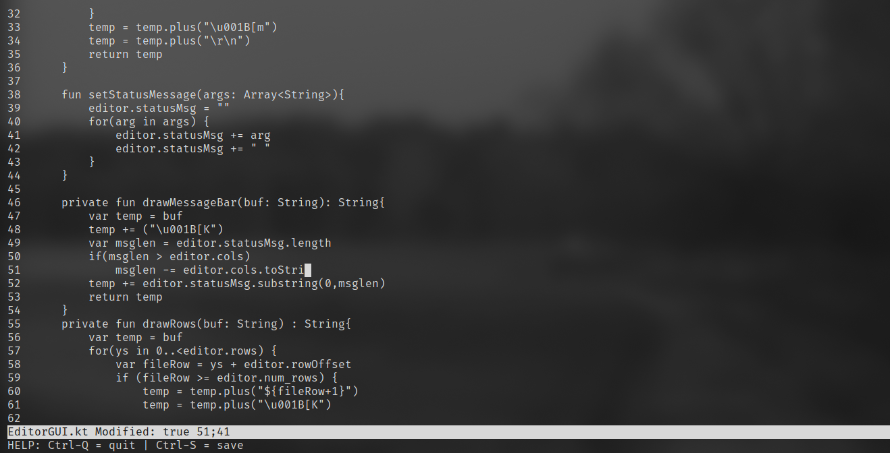
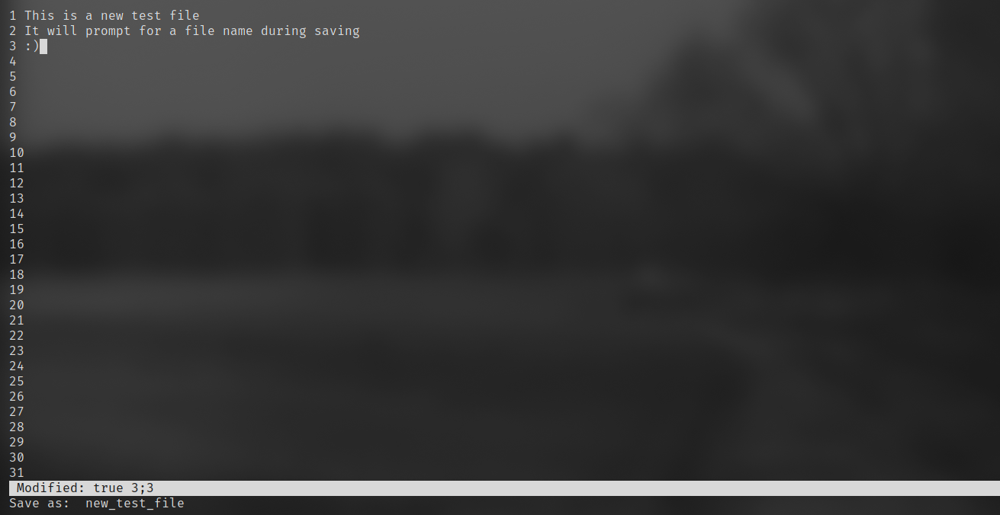

# AnEditor

AnEditor is (as the name implies) an editor of text (those are also sometimes called text editors) written in Kotlin. 

This editor is largely inspired by the tutorial originally written in C, which can be found here: [[Build Your Own Text Editor](https://viewsourcecode.org/snaptoken/kilo/index.html)], I decided to write it in Kotlin, for educational purposes

## Technical Details

Despite running on the JVM, currently it only works on Linux, since it requires functions like `tcgetattr` and `ioctl`  to work. It uses the JNA (Java Native Access) to access those C functions.

## Controls:

`CTRL-Q` to exit

`CTRL-S` to save the file

`PgUp` and `PgDn` for quicker navigation up and down

`Home` and `End` to go to the beggining or to the end of a line

`y` to confirm

## Screenshots

